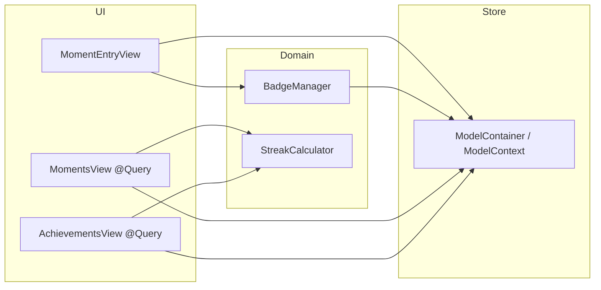

# GratefulMoments

感恩日记式 iOS 应用：用 **SwiftUI** 做界面，**SwiftData** 持久化 **Moment** 与 **Badge**，并通过 **TabView** 分为「时间线」与「成就」两大区域。

---

## UI 架构

### 入口与全局依赖

| 层级 | 职责 |
|------|------|
| `GratefulMomentsApp` | `@main`；创建 `DataContainer`；`WindowGroup` 里挂 `ContentView`，并 `.environment(dataContainer)` + `.modelContainer(...)`。 |
| `ContentView` | 根级 `TabView`：两个 `Tab`（Moments / Achievements）。 |
| `DataContainer`（`@Observable`） | 通过 `environment` 注入；提供 `context`（`ModelContext`）与 `badgeManager`。 |

预览使用 `View.sampleDataContainer()`：内存型 `ModelContainer` + 预置 `Moment.sampleData` 与徽章解锁流程，与真机持久化配置分离。

### 导航结构

```
TabView
├── Tab「Moments」
│   └── NavigationStack
│       ├── ScrollView → LazyVStack（Section：时间线 + 顶部 pinned streak 摘要）
│       ├── 空状态：ContentUnavailableView
│       └── Toolbar「+」→ sheet → MomentEntryView
└── Tab「Achievements」
    └── NavigationStack
        └── ScrollView → 连续打卡 + 已解锁横向滚动 + 未解锁列表
```

- **Moments**：`@Query(sort: \Moment.timestamp)` 驱动列表；每条为 `NavigationLink` → `MomentDetailView`；列表项主体为 `MomentHexagonView`（最后一条用 `layout: .large`，其余默认 `.standard`），非最后一项带正弦波横向 `offset` 形成路径感。
- **Achievements**：双份 `@Query<Badge>`（`timestamp != nil` / `== nil`）加分栏展示；另 `@Query` 全部 `Moment` 供 `StreakCalculator` 与 `StreakView` 使用。
- **新建**：`MomentEntryView` 在 sheet 内 `NavigationStack`，写入 `context` 后调用 `badgeManager.unlockBadges(newMoment:)` 再 `save()`。

### 组件分层（Custom Views / Tabs）

| 区域 | 主要视图 | 说明 |
|------|-----------|------|
| Custom Views | `Hexagon` | 泛型容器：可选背景图、六边形 mask、描边、`HexagonAccessoryView` 叠在右上角（仅当 `moment.badges` 非空）。 |
| | `HexagonLayout` | `compact` / `standard` / `medium` / `large`：边长、字体、内边距、描边宽度、路径偏移系数等。 |
| | `HexagonAccessoryView` | `NavigationLink`：单枚徽章进 `BadgeDetailView`；多枚时目标为 `MomentDetailView`；标签为单图或 `+数量`。 |
| Tabs / Moments | `MomentHexagonView` | 组合 `Hexagon` + 标题/笔记/日期；有图时用 material 条，无图时 `Color.ember` 底。 |
| | `MomentDetailView` | 详情、删除（`confirmationDialog` + `context.delete`）。 |
| | `MomentEntryView` | 标题、多行笔记、`PhotosPicker`，依赖 `DataContainer`。 |
| Tabs / Achievements | `StreakView` | 展示连续天数 UI。 |
| | `UnlockedBadgeView` / `LockedBadgeView` | 横向卡片 vs 锁定行。 |
| | `BadgeDetailView` | 单枚徽章详情。 |

### 状态与数据绑定要点

- 列表与成就页以 **`@Query`** 订阅 SwiftData，保存后自动刷新。
- 业务型操作（新建、删 moment、解锁徽章）走 **`ModelContext`** + **`BadgeManager`**，不单独维护一套 UI 状态树。
- `MomentHexagonView` 内 `layout` 为 `@State` 默认值；父视图传入 `layout: .large` 时需注意 SwiftUI 对 `@State` 初值仅初始化一次的语义（若将来改为按数据驱动布局，可改为普通 `var layout`）。

---

## 数据模型架构

### SwiftData 模型

**`Moment`（`@Model`）**

- 字段：`title`、`note`、`imageData`、`timestamp`、`badges: [Badge]`。
- `image` 为计算属性：由 `imageData` 生成 `UIImage?`。
- 扩展：`sampleData`（预览/测试用）、`hexagonLayout(isLastInTimeline:)`（按内容推断六边形档位，可与列表用法并存或单独使用）。

**`Badge`（`@Model`）**

- 字段：`details: BadgeDetails`、`moment: Moment?`、`timestamp: Date?`。
- **是否解锁**：`timestamp != nil` 视为已解锁；删除 moment 后徽章仍可保留时间与展示（见类型注释）。

**`BadgeDetails`（`Int` + `Codable` + `CaseIterable`）**

- 枚举项：`firstEntry`、`fiveStars`、`shutterbug`、`expressive`、`perfectTen`、`twentyMoments`、`thirtyDayStreak`。
- 承载 UI 文案、资源名（`ImageResource`）、主题色、解锁说明等；`perfectTenPrerequisites` 描述 Perfect 10 的前置四类徽章。

持久化中 `BadgeDetails` 以整型存储；升级应用时 **`BadgeManager.loadBadgesIfNeeded()`** 会对比 `allCases`，**补插缺失的徽章行**，避免新版本枚举增加后数据库缺行。

### 容器与写入路径

```
DataContainer
├── ModelContainer(schema: Moment, Badge)
├── badgeManager: BadgeManager(modelContainer)
└── loadBadgesIfNeeded() → 启动时补齐 Badge 行
```

- **新建 Moment**：`MomentEntryView` → `insert` → `unlockBadges(newMoment:)` → `save()`。
- **示例数据**：`includeSampleMoments == true` 时逐条 `insert` 并 `unlockBadges`，用于 Preview。

### 领域逻辑（非 `@Model`）

| 类型 | 作用 |
|------|------|
| `BadgeManager` | `unlockBadges`：拉取全部 moment、未解锁 badge；用 `StreakCalculator` 算 streak；对每条未解锁徽章调用静态 `shouldUnlock(...)`；满足则写入 `moment` 与 `timestamp`。`shouldUnlock` 可被单元测试直接覆盖。 |
| `StreakCalculator` | 输入按时间**升序**的 `[Moment]`，输出当前理解的连续「日历日」 streak（实现见 `StreakCalculator.swift` 内注释与分支）。 |
| `StreakView` / `MomentsView` 顶部条 | 均基于同一套 `StreakCalculator` + `moments` 数据。 |

### 数据流小结



---

## 工程与运行

- Xcode 打开 `GratefulMoments.xcodeproj`，选择模拟器或真机后 **Cmd+R** 运行。
- 单元测试目标 **`GratefulMomentsTests`**（如 `BadgeManagerTests`）验证 `BadgeManager.shouldUnlock` 与各徽章解锁集成场景。

---

## 目录约定（源码根 `GratefulMoments/`）

| 目录 | 内容 |
|------|------|
| `Models/` | `Moment`、`Badge`、`BadgeDetails`、`BadgeManager` |
| `Logic/` | `DataContainer`、`StreakCalculator` |
| `Custom Views/` | `Hexagon`、`HexagonLayout`、`HexagonAccessoryView` |
| `Tabs/Moments/` | 时间线、详情、新建、六边形单元 |
| `Tabs/Achievements/` | 成就列表、徽章卡片、连续打卡展示 |
| `Assets.xcassets` | 颜色、Tab 符号、样图、徽章图集等 |

更偏笔记/实验的记录可放在同级的 `Notes.md`（若存在）。
